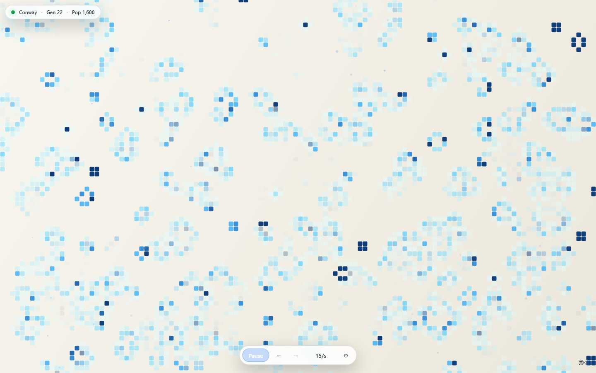
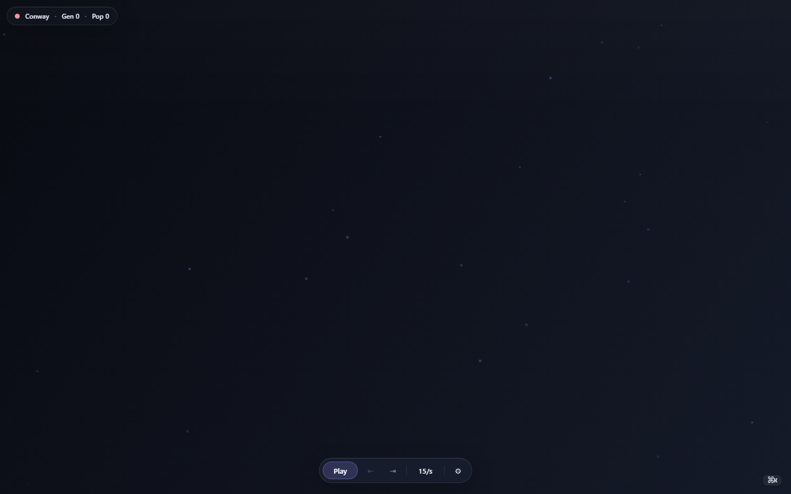
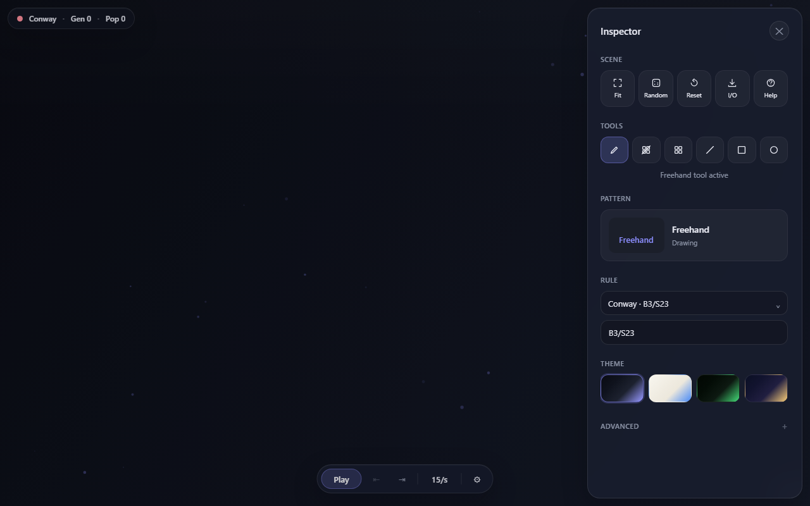

# Game of Life Studio

A polished web-based studio for Conway's Game of Life and related cellular automata. Infinite sparse grid, pattern library, custom rulesets, themes, and RLE import/export — runs in the browser with no install, no build, no dependencies.

[](LICENSE)
[](https://bizbrf.github.io/game-of-life-studio/game-of-life-v2/)



## Live demo

<https://bizbrf.github.io/game-of-life-studio/game-of-life-v2/>

## Features

### Simulation

- Sparse infinite grid (`Map<string, number>` backing store) — pan and zoom without boundaries
- Configurable rulesets: Conway (B3/S23), HighLife, Seeds, Day & Night, and custom B/S notation
- Wrap mode for toroidal simulations
- Variable speed from 1 to 60 generations per second

### Editing

- Freehand paint, eraser, line, box, and circle tools
- 13 built-in patterns (gliders, guns, still lifes, oscillators, spaceships) with live ghost preview
- Pattern browser with search and category filter
- Full undo / redo
- Generation rewind slider

### Import / export

- RLE import and export (standard Game of Life format)
- JSON export for round-tripping full app state
- Drag-and-drop file upload

### UI

- Light, dark, and additional themes with user-configurable accent colour
- Population sparkline
- Touch support (single-finger paint, two-finger pan-zoom)
- Keyboard shortcuts for every common action

## Screenshots

| Rest | Running | Inspector open |
|---|---|---|
|  |  |  |

## Running locally

No build step required.

```bash
# From the repo root
python -m http.server 8765 --bind 127.0.0.1
```

Then open <http://127.0.0.1:8765/game-of-life-v2/index.html>.

Any static file server works. Python's built-in is the simplest.

## Keyboard shortcuts

| Key | Action |
|---|---|
| `Space` | Play / pause |
| `N` | Step one generation (when paused) |
| `R` | Reset simulation |
| `F` | Random fill |
| `G` | Toggle grid lines |
| `W` | Toggle wrap mode |
| `T` | Cycle theme |
| `H`, `?` | Toggle help overlay |
| `Ctrl/Cmd + K` | Toggle inspector |
| `Ctrl/Cmd + Z` | Undo |
| `Ctrl/Cmd + Shift + Z` | Redo |
| `Tab` / `Shift + Tab` | Next / previous pattern |
| `+` / `-` | Speed up / slow down (large step) |
| `]` / `[` | Speed up / slow down (small step) |
| `1`–`6` | Select tool (freehand, eraser, stamp, line, box, circle) |
| `Esc` | Close modal or inspector |

Mouse:

- Left click — paint / use active tool
- Right click — erase
- Middle click — pan
- Wheel — zoom in / out
- `Shift + Wheel` — adjust speed
- Double-click — auto-fit to population

## Architecture

Plain HTML + CSS + ES modules. No framework, no bundler. 15 JavaScript modules split by responsibility (simulation, rendering, input, UI, history, I/O, ...).

- **[ARCHITECTURE.md](ARCHITECTURE.md)** — how the modules fit together
- **[docs/agents/module-map.md](docs/agents/module-map.md)** — tabular per-module reference
- **[docs/adr/](docs/adr/)** — architecture decision records
- **[docs/journal.md](docs/journal.md)** — running dev log

## Project structure

```text
game-of-life-studio/
├── game-of-life-v2/        # The app
│   ├── index.html
│   ├── styles/main.css
│   └── scripts/*.js        # 15 ES modules
├── docs/
│   ├── adr/                # architecture decision records
│   ├── agents/             # AI-agent framework (module map, protocols)
│   ├── handoffs/           # archived handoff contexts
│   ├── screenshots/        # canonical app screenshots
│   ├── specs/              # implementation specs
│   └── journal.md          # narrative dev log
├── AGENTS.md               # AI-agent rules (entry point)
├── ARCHITECTURE.md
├── CHANGELOG.md
├── CONTRIBUTING.md
└── LICENSE
```

## Contributing

See [CONTRIBUTING.md](CONTRIBUTING.md). AI agents should start at [AGENTS.md](AGENTS.md).

## License

[MIT](LICENSE).
